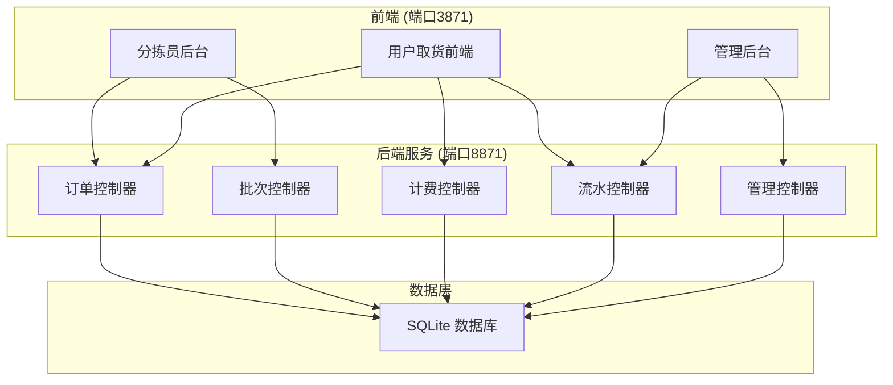
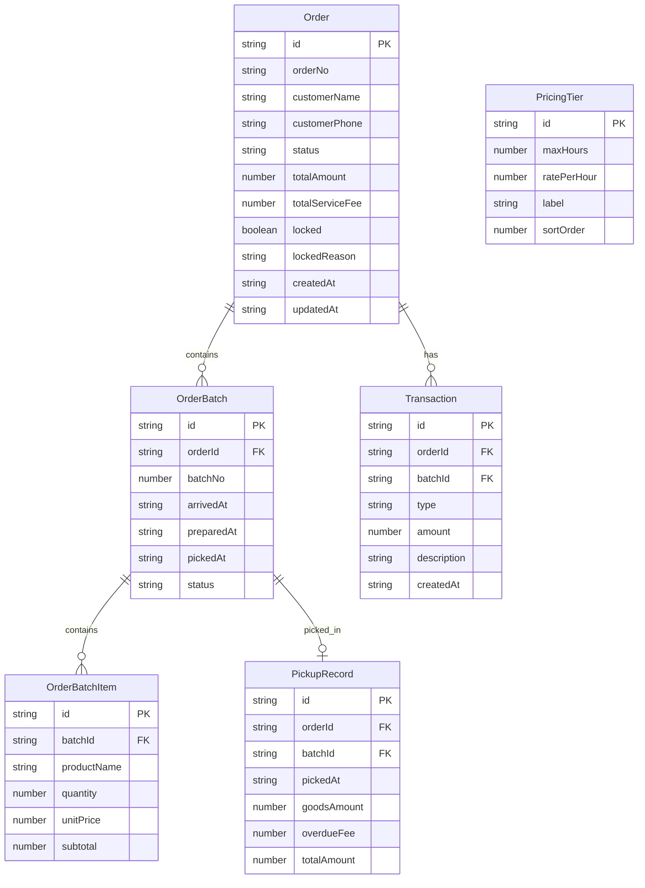

## 1. 架构设计



## 2. 技术说明

- 前端：React@18 + TailwindCSS@3 + Vite
- 初始化工具：Vite
- 后端：Express@4 + better-sqlite3
- 数据库：SQLite（文件型数据库，业务独立无需跨系统）
- 端口分配：后端 API 服务 8871，前端开发服务 3871

## 3. 路由定义

| 路由 | 用途 |
|------|------|
| `/` | 取货首页 - 订单查询入口 |
| `/order/:id` | 取货订单详情 - 商品批次、部分取货、费用明细 |
| `/sorter` | 分拣员后台 - 订单列表 |
| `/sorter/order/:id` | 分拣订单详情 - 批次备货标记 |
| `/admin` | 管理后台 - 对账流水、滞留订单、计费配置 |
| `/admin/transactions` | 对账流水 - 交易记录筛选 |
| `/admin/locked` | 滞留订单管理 - 锁定订单处理 |
| `/admin/pricing` | 阶梯计费配置 - 规则管理 |

## 4. API 定义

### 4.1 订单相关

```typescript
interface Order {
  id: string
  orderNo: string
  customerName: string
  customerPhone: string
  status: "pending" | "partial_picked" | "completed" | "locked"
  totalAmount: number
  totalServiceFee: number
  locked: boolean
  lockedReason: string | null
  createdAt: string
  updatedAt: string
}

interface OrderBatch {
  id: string
  orderId: string
  batchNo: number
  arrivedAt: string
  preparedAt: string | null
  pickedAt: string | null
  status: "arrived" | "prepared" | "picked"
}

interface OrderBatchItem {
  id: string
  batchId: string
  productName: string
  quantity: number
  unitPrice: number
  subtotal: number
}
```

### 4.2 计费相关

```typescript
interface PricingTier {
  id: string
  maxHours: number
  ratePerHour: number
  label: string
}

interface OverdueCalculation {
  batchId: string
  batchNo: number
  arrivedAt: string
  overdueHours: number
  tier1Hours: number
  tier2Hours: number
  tier1Fee: number
  tier2Fee: number
  totalFee: number
}
```

### 4.3 流水相关

```typescript
interface Transaction {
  id: string
  orderId: string
  batchId: string | null
  type: "pickup" | "overdue_fee" | "service_fee"
  amount: number
  description: string
  createdAt: string
}

interface PickupRecord {
  id: string
  orderId: string
  batchId: string
  pickedAt: string
  goodsAmount: number
  overdueFee: number
  totalAmount: number
  items: PickupItem[]
}

interface PickupItem {
  productName: string
  quantity: number
  unitPrice: number
  subtotal: number
}
```

### 4.4 API 路由

| 方法 | 路径 | 说明 |
|------|------|------|
| GET | `/api/orders` | 获取订单列表（支持筛选） |
| POST | `/api/orders` | 创建订单 |
| GET | `/api/orders/:id` | 获取订单详情（含批次及商品） |
| PATCH | `/api/orders/:id/lock` | 锁定/解锁订单 |
| GET | `/api/batches/:id/prepare` | 标记批次备货完成 |
| POST | `/api/batches/:id/pickup` | 批次取货（支持部分取货） |
| GET | `/api/orders/:id/overdue-fee` | 计算订单各批次逾期费用 |
| GET | `/api/transactions` | 获取流水列表（支持筛选） |
| GET | `/api/admin/locked-orders` | 获取滞留锁定订单 |
| POST | `/api/admin/locked-orders/:id/resolve` | 处理锁定订单 |
| GET | `/api/admin/pricing` | 获取阶梯计费规则 |
| PUT | `/api/admin/pricing` | 更新阶梯计费规则 |
| POST | `/api/simulate` | 模拟计费场景 |

## 5. 服务端架构图

```mermaid
flowchart LR
    "路由层 Router" --> "控制器层 Controller"
    "控制器层 Controller" --> "服务层 Service"
    "服务层 Service" --> "数据访问层 Repository"
    "数据访问层 Repository" --> "SQLite 数据库"
```

## 6. 数据模型

### 6.1 数据模型定义



### 6.2 数据定义语言

```sql
CREATE TABLE orders (
  id TEXT PRIMARY KEY,
  order_no TEXT NOT NULL UNIQUE,
  customer_name TEXT NOT NULL,
  customer_phone TEXT NOT NULL,
  status TEXT NOT NULL DEFAULT 'pending',
  total_amount REAL NOT NULL DEFAULT 0,
  total_service_fee REAL NOT NULL DEFAULT 0,
  locked INTEGER NOT NULL DEFAULT 0,
  locked_reason TEXT,
  created_at TEXT NOT NULL DEFAULT (datetime('now', 'localtime')),
  updated_at TEXT NOT NULL DEFAULT (datetime('now', 'localtime'))
);

CREATE TABLE order_batches (
  id TEXT PRIMARY KEY,
  order_id TEXT NOT NULL,
  batch_no INTEGER NOT NULL,
  arrived_at TEXT NOT NULL DEFAULT (datetime('now', 'localtime')),
  prepared_at TEXT,
  picked_at TEXT,
  status TEXT NOT NULL DEFAULT 'arrived',
  FOREIGN KEY (order_id) REFERENCES orders(id)
);

CREATE TABLE order_batch_items (
  id TEXT PRIMARY KEY,
  batch_id TEXT NOT NULL,
  product_name TEXT NOT NULL,
  quantity INTEGER NOT NULL,
  unit_price REAL NOT NULL,
  subtotal REAL NOT NULL,
  FOREIGN KEY (batch_id) REFERENCES order_batches(id)
);

CREATE TABLE pickup_records (
  id TEXT PRIMARY KEY,
  order_id TEXT NOT NULL,
  batch_id TEXT NOT NULL,
  picked_at TEXT NOT NULL DEFAULT (datetime('now', 'localtime')),
  goods_amount REAL NOT NULL,
  overdue_fee REAL NOT NULL DEFAULT 0,
  total_amount REAL NOT NULL,
  FOREIGN KEY (order_id) REFERENCES orders(id),
  FOREIGN KEY (batch_id) REFERENCES order_batches(id)
);

CREATE TABLE transactions (
  id TEXT PRIMARY KEY,
  order_id TEXT NOT NULL,
  batch_id TEXT,
  type TEXT NOT NULL,
  amount REAL NOT NULL,
  description TEXT NOT NULL,
  created_at TEXT NOT NULL DEFAULT (datetime('now', 'localtime')),
  FOREIGN KEY (order_id) REFERENCES orders(id)
);

CREATE TABLE pricing_tiers (
  id TEXT PRIMARY KEY,
  max_hours REAL NOT NULL,
  rate_per_hour REAL NOT NULL,
  label TEXT NOT NULL,
  sort_order INTEGER NOT NULL
);

CREATE INDEX idx_orders_status ON orders(status);
CREATE INDEX idx_orders_locked ON orders(locked);
CREATE INDEX idx_batches_order_id ON order_batches(order_id);
CREATE INDEX idx_batches_status ON order_batches(status);
CREATE INDEX idx_transactions_order_id ON transactions(order_id);
CREATE INDEX idx_transactions_type ON transactions(type);
CREATE INDEX idx_transactions_created_at ON transactions(created_at);

INSERT INTO pricing_tiers (id, max_hours, rate_per_hour, label, sort_order) VALUES
  ('tier1', 12, 0, '12小时内免费', 1),
  ('tier2', 24, 2, '12-24小时一档单价', 2),
  ('tier3', 999, 4, '超24小时双倍计费', 3);
```
